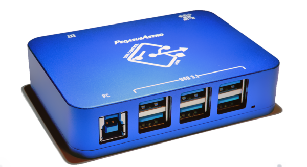

# Python3 script for Pegasus Astro USB Control Hub

This project implements a basic command-line tool for controlling 
the [USB Control Hub](https://pegasusastro.com/products/usb-control-hub/) made 
by [Pegasus Astro](https://pegasusastro.com/). The script is written in python3 and intended for Linux.



The USB Control Hub is a USB 3.1 SuperSpeed (5Gbps) hub with six USB3 type-A downstream facing ports (DFPs) and one USB3 type-B host (UFP) port. A serial control interface allows each of the six type-A ports to be independently switched on/off (power and data) through software. This software control is handy for any usage where you would otherwise reguarly need to unplug and replug USB cables.

## Features

PegasusAstro.com offers [official GUI software](https://pegasusastro.com/products/usb-control-hub/) for Windows and macOS, as well as an unofficial GUI script written in Python 2.7 for Raspberry Pi. 

The following features are unique to this script:

* **Linux and python3 support** 
  * Official software is only for Windows and macOS
  * Unofficial scripts only exist for python 2.7
* **Non-interactive command line usage**
  * This script does not prompt for user input while it works
  * All options are passed via command line parameters and results are printed to stdout, which lends to easier integration with other scripts and automation
  * Other existing software options use a GUI or interactive prompts to get user input
* **Allows multiple threads or multiple processes running the script to interact with a single USB Control Hub**
  * The script prevents conflict if two or more processes try to read/write to the device at the same time
  * Under the hood, the script uses a lock file at `/var/lock/uchserial.lck` as a mutex object to make sure only one process at a time uses the serial interface

## System Requirements

Only Linux is supported. I've only tested on Debian, but other distributions should work as well.

Python3 is required as well as additional packages listed in the `requirements.txt`. Install requirements using pip:

```
python3 -m pip install -r requirements.txt
```

## Basic Usage Examples

**Print the help message and usage examples**
```
python3 uch.py -h
```

**Print the on/off status of all 6 downstream ports**
```
python3 uch.py --port /dev/ttyUSB0 --list
```

**Get the on/off status of a downstream port number 3**
```
python3 uch.py --port /dev/ttyUSB0 3
```

**Set downstream port 1 to OFF**
```
python3 uch.py --port /dev/ttyUSB0 1 0
```

**Set downstream port 6 to ON**
```
python3 uch.py --port /dev/ttyUSB0 6 1
```

Tips:
* The hub downstream port numbers used 1-based indexing, so valid port numbers are: 1, 2, 3, 4, 5, 6.
* Each downstream port status may be `0` or `1`
  * `0` means OFF. USB power+data disconnected.
  * `1` means ON. USB power+data are connected.
* The serial port address argument (ex: `--port /dev/ttyUSB0`) is optional. If you omit the argument, the default port `/dev/ttyUSB0` is assumed.

## License

Apache 2.0; see [`LICENSE`](LICENSE) for details.
